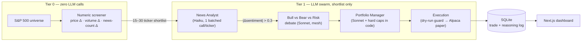

<div align="center">

# NEWS-TO-TRADE

**An agent swarm that reads the day's S&P 500 news, debates bull against bear,
and paper-trades the verdict — with the full reasoning chain published for every decision.**

[**Live demo →**](https://news-to-trade-agent.vercel.app)

`Python 3.11` · `LangGraph` · `Claude (Haiku + Sonnet)` · `Alpaca Paper Trading` · `Next.js 16` · `SQLite`

</div>

---

## Why this exists

Most "AI trading" demos are a backtest chart and a prayer. This one is built around a different deliverable: **the reasoning log**. Every executed trade records the headlines that triggered it, the sentiment score, a full bull/bear/risk debate transcript, the decision confidence, and the position-sizing rationale — queryable history, rendered live on a public dashboard.

The second design constraint is unusual for agent projects: **token spend is a first-class budget**, not an afterthought. You cannot point an LLM at 500 tickers a day and stay solvent. The architecture exists to make that impossible.

## The 2-tier pipeline



**Tier 0** runs pure numeric filters over all ~500 tickers — price delta, volume ratio, news-flow anomaly — and emits a shortlist. A test suite guarantee enforces that this module never imports an LLM library.

**Tier 1** spends tokens only on the shortlist, under hard rules:

| Rule | Enforcement |
|---|---|
| Never call an LLM per-ticker in the screener | `test_screener_imports_no_llm_modules` runs the import in a clean interpreter |
| Never re-summarize a cached headline | `headline-cache` memory checked before every call; all-cached ⇒ zero calls |
| One batched call per ticker, not N per headline | Single prompt carries every fresh headline |
| No debate below the sentiment-move threshold | LangGraph conditional edge — Sonnet is unreachable under 0.3 |
| LLM can shrink positions, never exceed caps | 5% max position and 10 trades/day clamped in code after the model responds |
| Log token spend per agent per run | `token_spend` table + daily cap alert |

## The debate

For each qualifying ticker, three Sonnet agents argue in sequence — **Bull** makes the strongest case for the trade, **Bear** (who has read Bull's argument) makes the strongest case against, and **Risk** arbitrates both into a `buy / hold / sell` verdict with a confidence score. The whole transcript lands in the log and on the dashboard. If either side's case is genuinely weak, its prompt tells it to say so.

## Safety rails

- **Paper trading only.** Live capital requires a human flag flip that doesn't exist yet.
- **Dry-run by default.** No order reaches Alpaca unless `--dry-run false` is passed explicitly; the execution agent raises otherwise.
- Stop-loss and take-profit are set **at execution time** on every bracket order, never discretionary after the fact.
- Daily trade cap kills runaway loops.

## Dashboard

Dark, typographic, glassmorphism over a black-and-white Wall Street backdrop — opening wordmark animation, custom cursor, company logos on every position.

- **Reasoning chain** — the debate transcripts, live
- **Trading history** — last 7 days, compare up to 3 days side by side
- **Performance** — equity curve with axes and a 7-day moving average
- Deployed build serves a self-refreshing demo snapshot until the pipeline runs on real keys

## Run it

```bash
# backend
brew install uv
uv venv --python 3.11 && uv pip install -e ".[dev]"
cp .env.example .env      # add Alpaca paper keys + Anthropic key
pytest                    # 15 tests, all offline
python -m graph.pipeline --dry-run   # full pipeline, no orders placed

# dashboard
python scripts/seed_demo.py
cd dashboard && npm install && npm run dev
```

## Layout

```
agents/          screener (no LLM) · news analyst · debate/{bull,bear,risk} · portfolio manager · execution · backtest
graph/pipeline.py   LangGraph wiring with the threshold gate as a conditional edge
data/            S&P 500 universe cache · one Alpaca client for broker + news
memory/          Ruflo memory wrapper with local JSON fallback (TTL namespaces)
db/models.py     Trade · ReasoningLog · TokenSpend · EquityPoint
dashboard/       Next.js 16 + Framer Motion
tests/           screener, agents, end-to-end dry run — no network, fake LLMs
```

---

<div align="center">

*Every trade argued on the record.*

</div>
